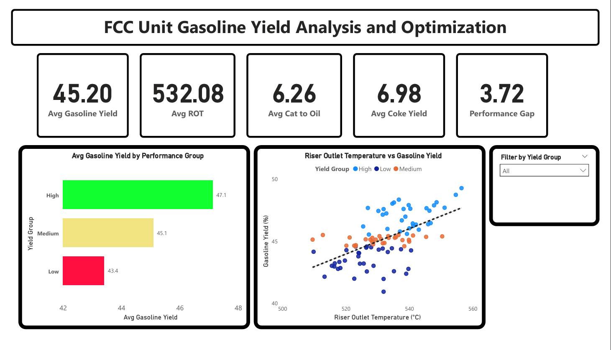
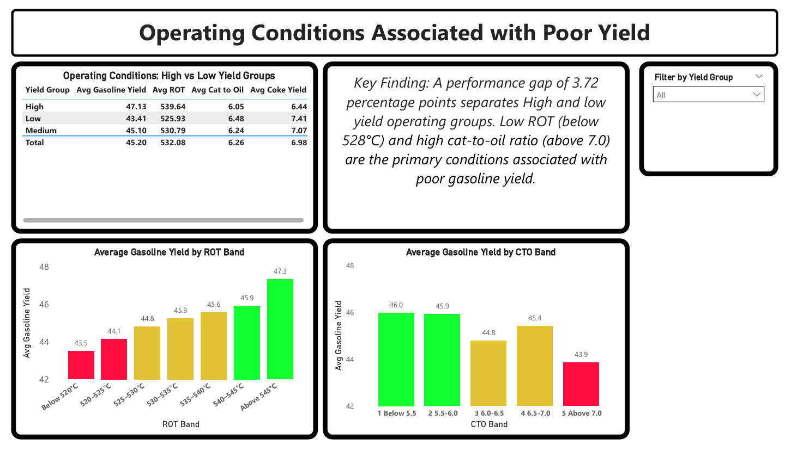
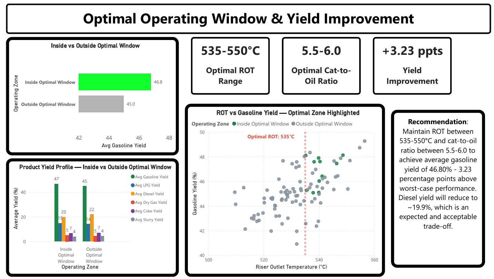
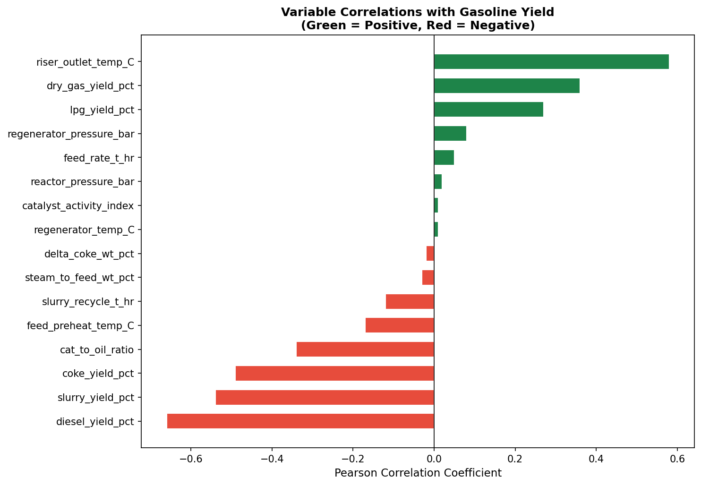
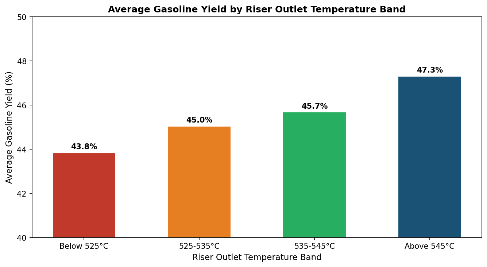
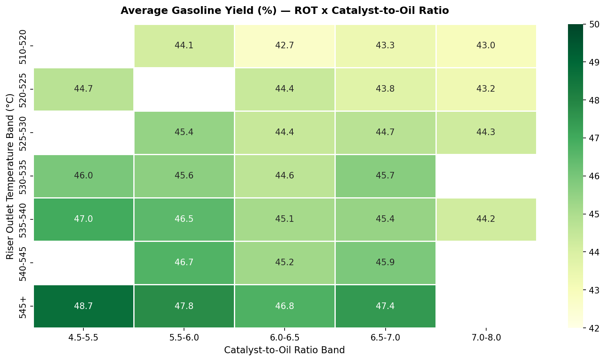
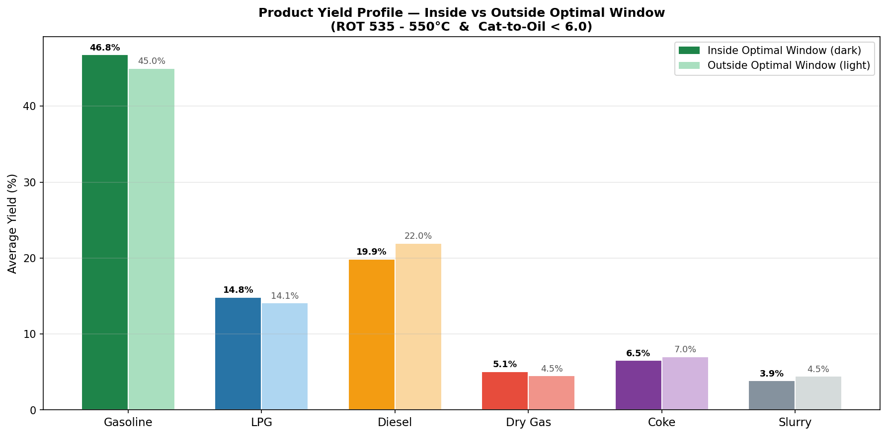

# FCC Unit Gasoline Yield Analysis & Optimization
### Diagnosing and Optimizing Gasoline Yield in a Fluid Catalytic Cracking Unit Using Python, SQL, and Power BI

---

## Project Overview

This project investigates gasoline yield underperformance in a Fluid Catalytic Cracking (FCC) unit — the most economically critical conversion unit in a petroleum refinery. Using a structured data analysis workflow, it identifies the process variables driving yield variability, diagnoses the specific operating conditions associated with poor performance, and defines an optimal operating window that maximizes gasoline yield while maintaining an acceptable balance of LPG, diesel, and coke production.

The project follows a professional research report format and is structured around two core analytical moves:
- **Move 1 — Diagnose:** Identify what is underperforming and why
- **Move 2 — Optimize:** Define the operating conditions that fix it

---

## The Problem

FCC gasoline yield is the primary economic metric of refinery conversion performance. Yield losses occur when key process variables — particularly the Riser Outlet Temperature (ROT) and catalyst-to-oil ratio, drift outside their optimal ranges. In practice, these variables interact: aggressive cracking conditions that raise gasoline yield can simultaneously over-produce dry gas and destabilize the coke-heat balance, while conservative settings suppress gasoline output.

**The central question this project answers:**
> *What process variables drive gasoline yield up or down, what operating conditions are associated with poor yield, and what is the optimal operating window that maximises gasoline yield without sacrificing LPG, diesel, or coke balance?*

---

## Project Aim

To identify the process variables driving gasoline yield inefficiency in an FCC unit and determine the optimal operating conditions that maximize gasoline yield while maintaining an acceptable LPG, diesel, and coke balance.

---

## Objectives

1. To collect, clean, and validate the FCC unit operational dataset
2. To conduct exploratory data analysis and identify performance patterns
3. To diagnose the process variables and operating conditions associated with poor gasoline yield
4. To determine the optimal operating window that maximises gasoline yield
5. To communicate findings through a Power BI dashboard and written operational recommendations

---

## Dataset

- **Source:** Synthetically generated using operating parameters and variable ranges reported in Zhang et al. (2021) — *Optimization Study on Increasing Yield and Capacity of FCC Units, Processes, 9(9), 1497*
- **Raw dataset:** 106 rows × 20 columns
- **Clean dataset:** 95 rows × 18 columns
- **Variables:** 11 process input variables + 6 product yield outputs + timestamp
- **Target variable:** `gasoline_yield_pct` (gasoline yield as weight % of feed)

> The raw and clean datasets are not included in this repository. They are available on request.

---

## Tools & Methods

| Tool | Purpose |
|---|---|
| **Excel** | Initial data inspection and sanity checks |
| **Python (pandas, matplotlib, seaborn)** | Data cleaning, EDA, correlation analysis |
| **SQL (pandasql)** | Condition segmentation and diagnostic queries |
| **Power BI** | Interactive 3-page dashboard |

---

## Key Findings

### Diagnosis (Move 1)
- **Riser Outlet Temperature (ROT)** is the strongest driver of gasoline yield (Pearson r = +0.58)
- **Catalyst-to-oil ratio** shows a threshold negative effect (r = −0.34) — yield declines sharply above 7.0
- Operating below **525°C ROT** and above **6.5 cat-to-oil ratio** simultaneously produces the lowest yield in the dataset: **43.57%**
- A performance gap of **3.72 percentage points** separates the High and Low yield operating groups

### Optimization (Move 2)
- **Optimal operating window:** ROT 535–550°C and catalyst-to-oil ratio 5.5–6.0
- **Gasoline yield inside optimal window:** 46.80%
- **Yield improvement vs worst case:** +3.23 percentage points
- **Yield improvement vs dataset mean:** +1.60 percentage points
- The optimal window simultaneously improves LPG yield (+0.73 ppts), reduces coke yield (−0.49 ppts), and reduces slurry yield (−0.61 ppts) — confirming no unacceptable co-product trade-offs

---

## Dashboard Preview

The Power BI dashboard presents findings across three pages:

**Page 1 — Performance Overview**
Five KPI cards, average gasoline yield by performance group, ROT vs gasoline yield scatter plot, and yield group slicer.

**Page 2 — Diagnosis**
Operating conditions comparison table, gasoline yield by ROT band, gasoline yield by catalyst-to-oil ratio band, and key diagnostic finding.

**Page 3 — Optimization**
Optimal window KPI cards, inside vs outside yield comparison, full product yield profile, ROT vs gasoline yield scatter with optimal zone highlighted, and operational recommendation.

---

## Key Visualizations

**Ranked Variable Correlations with Gasoline Yield**

**Average Gasoline Yield by ROT Band**

**ROT × Catalyst-to-Oil Ratio Heatmap**

**Product Yield Profile — Inside vs Outside Optimal Window**

---

## Recommendations

1. Maintain ROT within **535–550°C** to maximize gasoline yield
2. Maintain catalyst-to-oil ratio within **5.5–6.0**; avoid sustained operation above 7.0
3. Treat ROT below 528°C combined with cat-to-oil above 6.5 as a **priority alarm condition**
4. Monitor dry gas yield as a leading indicator of over-cracking when ROT exceeds 545°C
5. Accept a diesel yield reduction of 2–4 percentage points as an expected trade-off when operating in the optimal gasoline window

---

## Reference

Zhang, Y., Li, Z., Wang, Z., & Jin, Q. (2021). Optimization study on increasing yield and capacity of fluid catalytic cracking (FCC) units. *Processes*, *9*(9), 1497. https://doi.org/10.3390/pr9091497

---

## About

**Winnie** | Chemical/Petrochemical Engineering Graduate | Aspiring Data Scientist | Building towards Energy Process Optimization

*I help energy companies find and fix the inefficiencies hiding in their process data.*

> Full research report, Python notebook, SQL queries, and dataset available on request.
